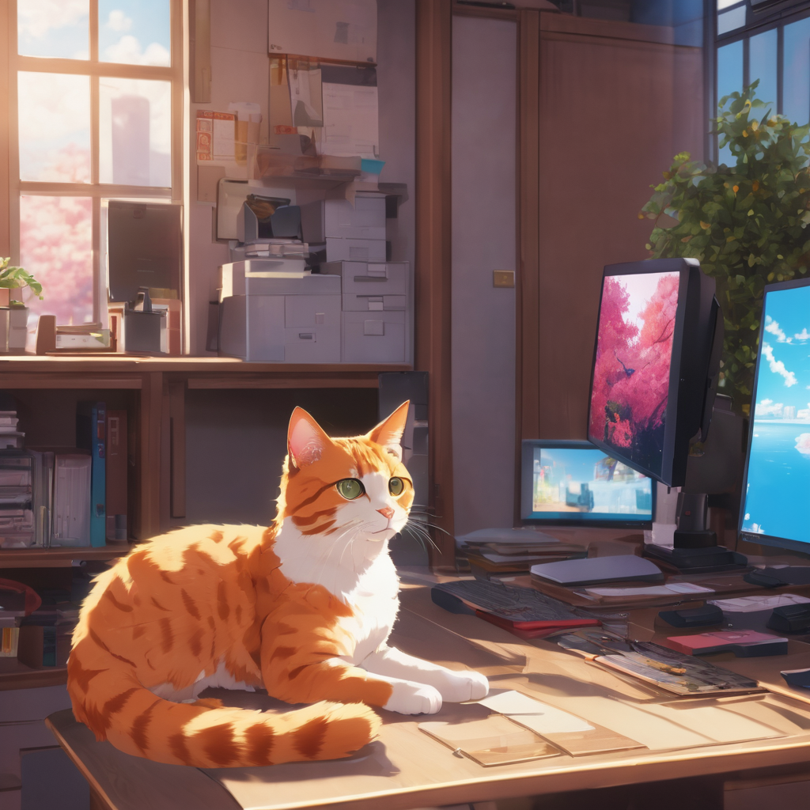
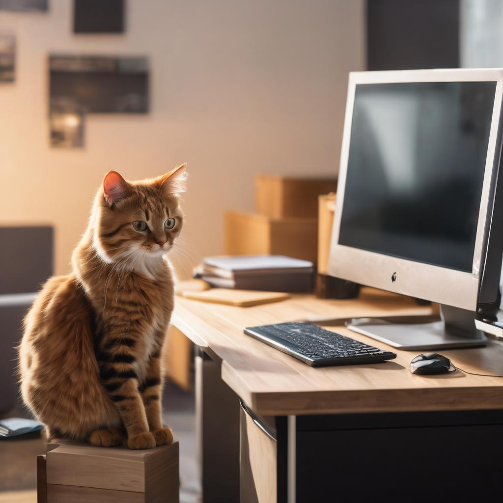
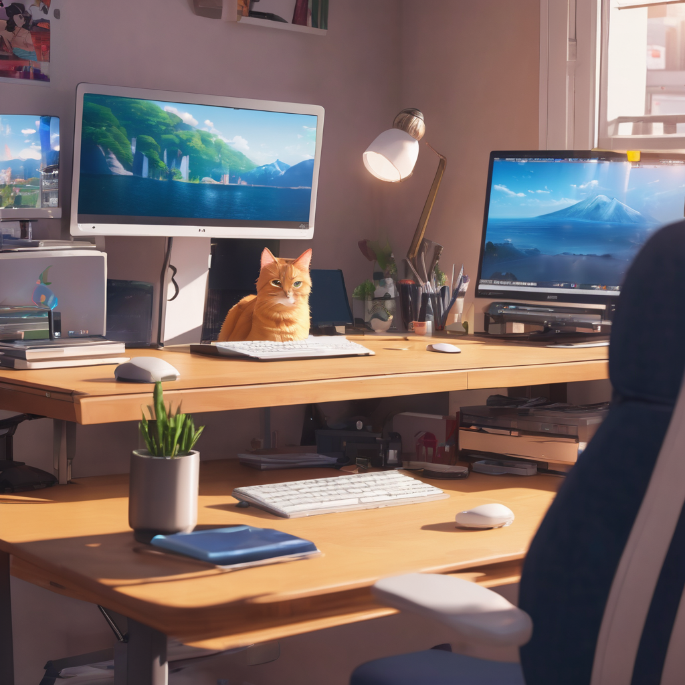

# CodeMeowWorkstation





Welcome to the Code Meow Workstation project. This open-source project. A website that collects pictures of computer desks and cats from everyone.

## Getting Started

- After Cloning CodeMeowWorkstation Project.
- Open Data.js file in the project.
- Add your image in img folder.
- Add your data in the Profiles.
- After change,save the data.
- Which is given below.

```javascript
//for example
const Profiles = [
  {
    name: "NongSnail",
    work: "Student",
    msg: "this is my cat =w=",
    githubURL: "https://github.com/NongSnail",
    image: "./img/{githubname}.jpg",
  },
  // Add your Data
];
```

## Contributing Guideline

We welcome contributions to our project. To get started, please follow these simple steps:

1. Fork the repository.
2. Clone your forked repository to your local machine.
3. Create a new branch for your work.
4. Make your changes.
5. Commit your changes.
6. Push your changes to your fork.
7. Create a pull request.

That's it! We appreciate your contributions.

## Contributor

Thanks a lot for spending your time helping CodeMeowWorkstation grow. Thanks a lot! <br>
<a href="https://github.com/NongSnail/CodeMeowWorkstation/graphs/contributors">

</a>

Made with [contrib.rocks](https://contrib.rocks).
